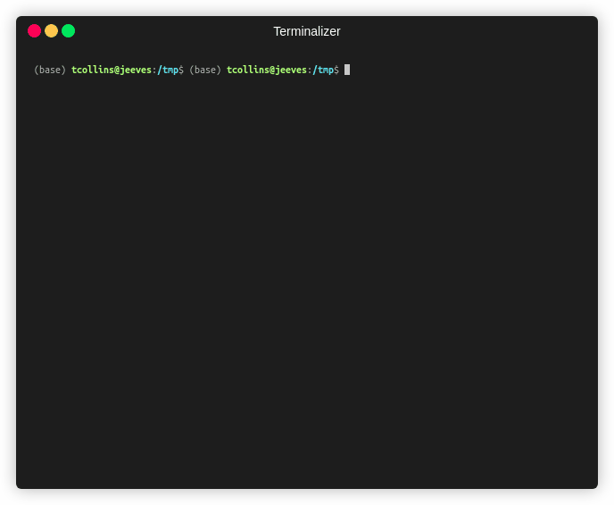

# pyadi-dt

<a href="http://analogdevicesinc.github.io/pyadi-dt/">

</a>

Device tree management tools for ADI hardware



## Quick install

```bash
pip install git+https://github.com/analogdevicesinc/pyadi-dt.git
```

## CLI basics

Get basic info of CLI
```bash
> adidtc
Usage: adidtc [OPTIONS] COMMAND [ARGS]...

  ADI device tree utility

Options:
  -nc, --no-color                 Disable formatting
  -c, --context [local_file|local_sd|local_sysfs|remote_sysfs|remote_sd]
                                  Set context  [default: local_sysfs]
  -i, --ip TEXT                   Set ip used by remote contexts  [default:
                                  192.168.2.1]
  -u, --username TEXT             Set username used by remote SSH sessions
                                  (default is root)  [default: root]
  -w, --password TEXT             Set password used by remote SSH sessions
                                  (default is analog)  [default: analog]
  -a, --arch [arm|arm64|auto]     Set target architecture which will set the
                                  target DT. auto with determine from running
                                  system  [default: auto]
  --help                          Show this message and exit.

Commands:
  jif      JIF supported updates of DT
  prop     Get and set device tree properties
  props    Get, set, and explore device tree properties
  sd-move  Move files on existing SD card
```

Use the **prop** sub command to read device tree attributes
```bash
> adidtc -c remote_sysfs -i 192.168.2.1 prop -cp adi,ad9361 clock-output-names
clock-output-names rx_sampl_clk,tx_sampl_clk
```

## Device Tree Generation

Generate device tree source (DTS) files for AD9081 FMC evaluation boards across multiple FPGA platforms (ZCU102, VPK180, ZC706).

### Quick Example

```bash
# Generate DTS for ZCU102
adidtc gen-dts --platform zcu102 --config my_config.json

# Generate and compile to DTB
adidtc gen-dts --platform vpk180 --config my_config.json --compile
```

### Supported Platforms

- **ZCU102**: Zynq UltraScale+ (ARM64, GTH transceivers)
- **VPK180**: Versal (ARM64, GTY transceivers)
- **ZC706**: Zynq-7000 (ARM, GTX transceivers)

### Features

- Platform-specific device tree generation from JSON configurations
- Automatic FPGA transceiver configuration (QPLL/CPLL settings)
- HMC7044 clock chip configuration
- AD9081 JESD204B/C link configuration
- ADC/DAC datapath configuration (CDDC, FDDC, CDUC, FDUC)
- Optional DTB compilation with proper include paths

### Setup

The tool requires Linux kernel source for platform base DTS files:

```bash
# Option 1: Clone to default location
git clone https://github.com/analogdevicesinc/linux.git

# Option 2: Set environment variable
export LINUX_KERNEL_PATH=/path/to/your/linux

# Option 3: Pass via CLI
adidtc gen-dts -p zcu102 -c config.json -k /path/to/linux
```

### Documentation

See [doc/source/ad9081_device_tree_generation.md](doc/source/ad9081_device_tree_generation.md) for:
- Complete configuration file format
- FPGA configuration options
- Python API usage
- Troubleshooting guide
- Adding new platforms

## XSA Pipeline Diagnostics

`adidtc xsa2dt` now prints parity artifact diagnostics so incomplete or malformed outputs are visible immediately:

```bash
adidtc xsa2dt -x examples/xsa/system_top.xsa -c cfg.json -o out --reference-dts ref.dts
```

Example diagnostic lines:

- `Coverage % (roles/links/properties/overall): 75.0/40.0/100.0/66.7`
- `Overall matched items: 8/12`
- `Missing gaps (roles/links/properties/mismatched): 1/2/0/1`
- `Warning: parity map not found: ...`
- `Warning: parity coverage report not found: ...`
- `Warning: unable to parse parity map JSON at ...`
- `Warning: parity map path is not path-like: ...`
- `Warning: parity coverage report path is not path-like: ...`
- `Warning: parity map path is empty`
- `Warning: parity coverage report path is empty`
- `Warning: parity map path is null`
- `Warning: parity coverage report path is null`
- `Warning: parity map path is invalid: ...`
- `Warning: parity coverage report path is invalid: ...`
- `Warning: parity map JSON root is not an object: ...`

The command also fails fast when pipeline results:

- return an invalid result type (must be a dictionary)
- omit required artifacts (`overlay`, `merged`, or `report`)
- provide empty required artifact values
- provide non-path required artifact values
- provide invalid required path-like values (path coercion errors)
- receive an invalid JSON config file
- encounter XSA parser/config exceptions raised by the pipeline
- encounter sdtgen execution or availability failures
- hit unexpected runtime exceptions in the XSA pipeline flow

Required artifact error messages follow canonical pipeline order:
`overlay, merged, report`.

## Building Documentation

Documentation is built using Sphinx with the ADI cosmic theme.

### Setup

```bash
# Install documentation dependencies
pip install -r requirements/requirements_doc.txt

# Install package in development mode
pip install -e .
```

### Build

```bash
# Build HTML documentation
cd doc
make html

# View the documentation (open in browser)
open build/html/index.html  # macOS
xdg-open build/html/index.html  # Linux
start build/html/index.html  # Windows
```

### Additional Commands

```bash
# Check documentation coverage
make coverage

# Validate links
make linkcheck

# Clean build artifacts
make clean
```

The documentation is automatically built and deployed to GitHub Pages on every push to the main branch.
