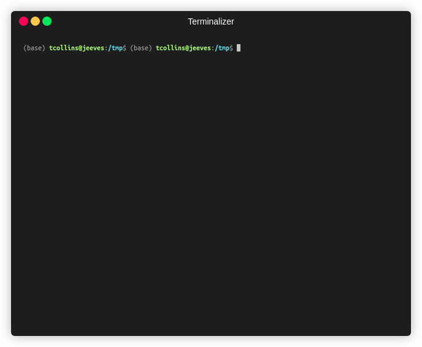

<p align="center">

</p>

<h3 align="center">Device Tree Generation for Analog Devices Hardware</h3>

<p align="center">
<a href="https://github.com/analogdevicesinc/pyadi-dt/actions/workflows/test.yml"></a>
<a href="https://analogdevicesinc.github.io/pyadi-dt/"></a>
<a href="https://github.com/analogdevicesinc/pyadi-dt/blob/main/LICENSE"></a>
<a href="https://www.python.org/downloads/"></a>
</p>

---

**pyadi-dt** is a Python library and CLI for generating, inspecting, and managing Linux device trees for Analog Devices data converters, clock ICs, RF transceivers, and FPGA-based JESD204 data paths.

## Key Features

- **XSA-to-DTS pipeline** — Generate device trees from Vivado `.xsa` archives using built-in board profiles
- **AD9371 profile import** — Translate canonical iio-oscilloscope AD9371 profile-wizard files into Linux device-tree properties
- **BoardModel API** — Build, edit, and render device tree overlays programmatically
- **88 Kuiper boards** — Full manifest of ADI Kuiper 2023-R2 supported boards
- **RPi support** — Generate overlays for ADI sensors on Raspberry Pi (ADIS16495, ADXL345, AD7124, etc.)
- **15 board classes** — DAQ2, AD9081–AD9084, ADRV9002–ADRV9025, ADRV937x, ADRV9361-Z7035, ADRV9364-Z7020, FMComms, RPi
- **Component factories** — Pre-configured factories for 12+ ADI devices
- **Visualization** — Interactive HTML reports, clock-tree diagrams (DOT/D2), DTS linter
- **Hardware validated** — FMCDAQ2, FMCDAQ3, AD9081, ADRV9009 on ZCU102

## Quick Install

```bash
pip install adidt
```

With XSA pipeline support (requires Vivado `sdtgen`):

```bash
pip install "adidt[xsa]"
```

## Quick Examples

### Generate a DTS from an XSA file

```bash
adidtc xsa2dt -x design.xsa --profile ad9081_zcu102 -o out/
```

### Generate system-user.dtsi for PetaLinux

```bash
adidtc xsa2dt -x design.xsa -c cfg.json --format petalinux --petalinux-project /path/to/project
```

### Generate a DTS from Python (BoardModel API)

```python
from adidt.model import BoardModel, components
from adidt.model.renderer import BoardModelRenderer

model = BoardModel(
    name="rpi5_imu",
    platform="rpi5",
    components=[
        components.adis16495(spi_bus="spi0", cs=0, interrupt_gpio=25),
    ],
)
nodes = BoardModelRenderer().render(model)
```

### Generate a DTS for an FPGA board

```python
import adidt

fmc = adidt.eval.ad9081_fmc()
fmc.converter.set_jesd204_mode(1, "jesd204c")
fpga = adidt.fpga.zcu102()
system = adidt.System(name="ad9081_zcu102", components=[fmc, fpga])
system.connect_spi(bus_index=0, primary=fpga.spi[0], secondary=fmc.clock.spi, cs=0)
system.connect_spi(bus_index=1, primary=fpga.spi[1], secondary=fmc.converter.spi, cs=0)
system.add_link(
    source=fmc.converter.adc, sink=fpga.gt[0],
    sink_reference_clock=fmc.dev_refclk,
    sink_core_clock=fmc.core_clk_rx,
    sink_sysref=fmc.dev_sysref,
)
print(system.generate_dts())
```

See `examples/ad9081_fmc_zcu102.py` for the full RX+TX wiring.

### Generate AD9371 profile properties from a canonical profile

```python
from adidt.profiles import parse_ad9371_profile

profile = parse_ad9371_profile(
    "examples/xsa/profiles/ad9371_5/profile_TxBW200_ORxBW200_RxBW100.txt"
)
for statement in profile.to_dt_properties():
    print(statement)
```

The XSA pipeline accepts the same file through
`adrv9009_board.ad9371_profile_path`. See
`examples/xsa/adrv937x_zc706.py --help` for a runnable end-to-end example.

### List Kuiper-supported boards

```bash
adidtc kuiper-boards
```

### Inspect device trees on live hardware

```bash
adidtc -c remote_sysfs -i 192.168.2.1 prop -cp adi,ad9361 clock-output-names
```



## Supported Hardware

| Converter Family | Platforms | HW Validated |
|---|---|---|
| AD9081 / AD9082 / AD9083 (MxFE) | ZCU102, ZC706, VPK180 | ZCU102 ✓ |
| AD9084 | VCU118, VPK180 | |
| ADRV9009 / ADRV9025 / ADRV9008 | ZCU102, ZC706, Arria10, ZU11EG | ZCU102 ✓ |
| AD9371 / ADRV937x | ZC706, ZCU102 | ZC706 ✓ |
| ADRV9009-ZU11EG (SOM) | ADRV2CRR-FMC carrier | |
| AD936x / FMComms2-5 (SDR) | Zedboard, ZC702, ZC706, ZCU102 | |
| ADRV9361-Z7035 / ADRV9364-Z7020 (SOM) | BOB, FMC carriers | |
| FMCDAQ2 (AD9680 + AD9144) | ZCU102, ZC706, Arria10 | ZCU102 ✓ |
| FMCDAQ3 (AD9680 + AD9152) | ZCU102, ZC706 | ZCU102 ✓ |
| Precision ADCs / Sensors | Zedboard, Raspberry Pi | |

## Documentation

- [Quick Start](https://analogdevicesinc.github.io/pyadi-dt/quickstart.html)
- [Device-centric API](https://analogdevicesinc.github.io/pyadi-dt/api/devices.html)
- [XSA Pipeline Guide](https://analogdevicesinc.github.io/pyadi-dt/xsa.html)
- [BoardModel API Reference](https://analogdevicesinc.github.io/pyadi-dt/api/model.html)
- [Authoring Devices](https://analogdevicesinc.github.io/pyadi-dt/developer/authoring_devices.html)
- [Visualization & Diagnostics](https://analogdevicesinc.github.io/pyadi-dt/visualization.html)
- [Developer Guide](https://analogdevicesinc.github.io/pyadi-dt/xsa_developer.html)

## AI agent skill

The repository includes an [Agent Skill](skills/pyadi-dt-cli/SKILL.md) that
teaches compatible coding agents to discover and use `adidtc`, select the least
invasive device-tree access context, generate and validate XSA outputs, and
handle hardware-changing commands safely.

Install it for Agent Skills-compatible tools and Claude Code:

```bash
./skills/pyadi-dt-cli/scripts/install.sh
```

Install for only one skill directory with `agents` or `claude`, for example:

```bash
./skills/pyadi-dt-cli/scripts/install.sh agents
```

The installer creates a symlink, so the installed skill follows the checked-out
version. Start a new agent session after installation.

## Development

```bash
# Install with dev dependencies
pip install -e ".[dev]"

# Run tests
pytest -vs

# Type check
nox -s ty

# Build docs
nox -s docs
```

## License

[Eclipse Public License 2.0](LICENSE)
